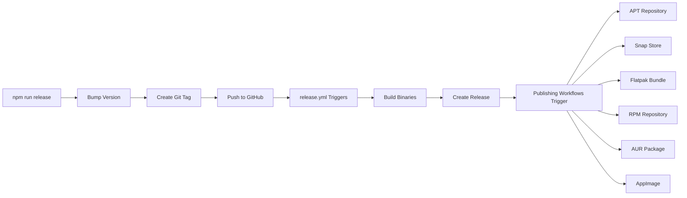

# Package Publishing Documentation

ScreenKey is automatically published to multiple package repositories and formats via GitHub Actions.

## 📦 Available Installation Methods

| Format       | Repository               | Users                | Auto-Update | Workflow                                                       |
| ------------ | ------------------------ | -------------------- | ----------- | -------------------------------------------------------------- |
| **DEB**      | APT (GitHub Pages)       | Debian, Ubuntu       | ✅ Yes      | [publish-apt.yml](.github/workflows/publish-apt.yml)           |
| **Snap**     | Snap Store               | Universal Linux      | ✅ Yes      | [publish-snap.yml](.github/workflows/publish-snap.yml)         |
| **Flatpak**  | Release assets / Flathub | Universal Linux      | ✅ Yes      | [publish-flatpak.yml](.github/workflows/publish-flatpak.yml)   |
| **RPM**      | YUM/DNF (GitHub Pages)   | Fedora, RHEL, CentOS | ✅ Yes      | [publish-rpm.yml](.github/workflows/publish-rpm.yml)           |
| **AUR**      | Arch User Repository     | Arch, Manjaro        | ⚠️ Manual   | [publish-aur.yml](.github/workflows/publish-aur.yml)           |
| **AppImage** | Release assets           | Universal Linux      | ⚠️ zsync    | [publish-appimage.yml](.github/workflows/publish-appimage.yml) |

## 🚀 Publishing Process

### Automated Release Flow



### Step-by-Step Release

1. **Prepare release** (from `screenkey-app/` directory):

   ```bash
   # Ensure all changes are committed
   git status

   # Run release script
   npm run release        # Patch (0.0.x)
   npm run release:minor  # Minor (0.x.0)
   npm run release:major  # Major (x.0.0)
   ```

2. **Automated process**:

   - Version bumped in `package.json`, `tauri.conf.json`, `Cargo.toml`
   - `CHANGELOG.md` updated with version and date
   - Git commit created: `chore: bump version to X.X.X`
   - Git tag created: `vX.X.X`
   - Push triggers GitHub Actions

3. **Build and release** ([release.yml](.github/workflows/release.yml)):

   - Builds for Linux, macOS (Intel/ARM), Windows
   - Creates GitHub release (draft → published)
   - Uploads `.deb`, `.dmg`, `.msi`, `.AppImage` files

4. **Distribution** (triggered on release publication):
   - **APT**: Debian packages published to GitHub Pages
   - **Snap**: Package uploaded to Snap Store (stable channel)
   - **Flatpak**: Bundle created and uploaded to release
   - **RPM**: RPM packages published to GitHub Pages
   - **AUR**: PKGBUILD pushed to AUR repository
   - **AppImage**: Portable binary with zsync file

## 📋 Workflow Details

### APT Repository (Debian/Ubuntu)

**File:** [`.github/workflows/publish-apt.yml`](.github/workflows/publish-apt.yml)

- Downloads `.deb` from release assets
- Generates APT metadata (`Packages`, `Release`)
- Signs repository with GPG
- Deploys to `gh-pages-apt` branch
- Published at: `https://[username].github.io/screenkey/`

**Installation:**

```bash
curl -fsSL https://rusmanplatd.github.io/screenkey/KEY.gpg | sudo gpg --dearmor -o /usr/share/keyrings/screenkey.gpg
echo "deb [signed-by=/usr/share/keyrings/screenkey.gpg] https://rusmanplatd.github.io/screenkey stable main" | sudo tee /etc/apt/sources.list.d/screenkey.list
sudo apt update && sudo apt install screenkey-app
```

### Snap Store

**File:** [`.github/workflows/publish-snap.yml`](.github/workflows/publish-snap.yml)

- Builds snap with classic confinement
- Uploads to Snap Store (stable channel)
- Requires `SNAPCRAFT_TOKEN` secret

**Installation:**

```bash
sudo snap install screenkey --classic
```

### Flatpak

**File:** [`.github/workflows/publish-flatpak.yml`](.github/workflows/publish-flatpak.yml)

- Builds Flatpak bundle
- Creates AppData metadata
- Uploads `.flatpak` to release assets
- Manual Flathub submission required

**Installation:**

```bash
wget https://github.com/rusmanplatd/screenkey/releases/latest/download/screenkey.flatpak
flatpak install screenkey.flatpak
```

### RPM Repository (Fedora/RHEL/CentOS)

**File:** [`.github/workflows/publish-rpm.yml`](.github/workflows/publish-rpm.yml)

- Builds RPM from binary
- Creates YUM/DNF repository
- Deploys to `gh-pages-rpm` branch
- Published at: `https://[username].github.io/screenkey-rpm/`

**Installation:**

```bash
sudo curl -o /etc/yum.repos.d/screenkey.repo https://rusmanplatd.github.io/screenkey-rpm/screenkey.repo
sudo dnf install screenkey-app
```

### AUR (Arch Linux)

**File:** [`.github/workflows/publish-aur.yml`](.github/workflows/publish-aur.yml)

- Generates `PKGBUILD` and `.SRCINFO`
- Pushes to `ssh://aur@aur.archlinux.org/screenkey-app.git`
- Requires `AUR_SSH_PRIVATE_KEY` secret

**Installation:**

```bash
yay -S screenkey-app
# or
paru -S screenkey-app
```

### AppImage

**File:** [`.github/workflows/publish-appimage.yml`](.github/workflows/publish-appimage.yml)

- Builds portable AppImage
- Bundles all dependencies
- Generates zsync for delta updates
- Uploads to release assets

**Installation:**

```bash
wget https://github.com/rusmanplatd/screenkey/releases/latest/download/ScreenKey-x86_64.AppImage
chmod +x ScreenKey-*.AppImage
sudo ./ScreenKey-*.AppImage
```

## 🔐 Required Secrets

Configure in **Settings → Secrets and variables → Actions**:

| Secret                | Used By          | Purpose                    |
| --------------------- | ---------------- | -------------------------- |
| `APT_GPG_PRIVATE_KEY` | publish-apt.yml  | Sign APT repository        |
| `APT_GPG_KEY_ID`      | publish-apt.yml  | GPG key identifier         |
| `SNAPCRAFT_TOKEN`     | publish-snap.yml | Authenticate to Snap Store |
| `AUR_SSH_PRIVATE_KEY` | publish-aur.yml  | Push to AUR repository     |

See [`.github/PUBLISHING_SETUP.md`](.github/PUBLISHING_SETUP.md) for detailed setup instructions.

## 🧪 Testing Workflows

### Manual Trigger

Test individual workflows without creating a release:

```bash
# Via GitHub CLI
gh workflow run publish-apt.yml
gh workflow run publish-snap.yml
gh workflow run publish-flatpak.yml
gh workflow run publish-rpm.yml
gh workflow run publish-aur.yml
gh workflow run publish-appimage.yml
```

### Dry Run (No Secrets)

Workflows run partially without secrets:

- ✅ Build packages
- ✅ Upload as artifacts
- ❌ Skip actual publishing

### Full Test

Create a test release:

```bash
git tag v0.0.13-test
git push origin v0.0.13-test
# Monitor Actions tab
# Delete release and tag after testing
```

## 📊 Distribution Statistics

After each release, packages are available at:

- **GitHub Releases**: All formats (`.deb`, `.rpm`, `.AppImage`, `.flatpak`)
- **APT Repository**: Debian/Ubuntu users
- **Snap Store**: snapcraft.io/screenkey
- **Flathub**: flathub.org/apps/com.screenkey.app (after manual submission)
- **RPM Repository**: Fedora/RHEL users
- **AUR**: aur.archlinux.org/packages/screenkey-app

## 🔄 Update Process

### For Package Maintainers

When a new version is released:

1. **APT/RPM**: Auto-updates via GitHub Pages
2. **Snap**: Auto-published to Snap Store
3. **AUR**: Auto-pushed to AUR repository
4. **Flatpak**: Requires manual PR to Flathub
5. **AppImage**: New binary uploaded to releases

### For Users

Users get updates based on installation method:

```bash
# APT (Debian/Ubuntu)
sudo apt update && sudo apt upgrade screenkey-app

# Snap
sudo snap refresh screenkey

# Flatpak
flatpak update com.screenkey.app

# RPM (Fedora/RHEL)
sudo dnf update screenkey-app

# AUR (Arch Linux)
yay -Syu screenkey-app

# AppImage (zsync)
zsync ScreenKey-x86_64.AppImage.zsync
```

## 🐛 Troubleshooting

### Workflow fails with "Secret not found"

- Verify secret name matches exactly (case-sensitive)
- Check secret is in repository secrets, not organization

### APT: GPG signature verification failed

- Regenerate GPG key if expired
- Verify `APT_GPG_KEY_ID` matches key ID
- Ensure private key is complete

### Snap: Authentication failed

- Regenerate token: `snapcraft export-login`
- Verify 2FA enabled on snapcraft.io
- Check snap name is registered

### AUR: Permission denied

- Verify SSH key added to AUR account
- Ensure private key has no passphrase
- Check package name registered on AUR

### GitHub Pages not updating

- Enable GitHub Pages in repository settings
- Select correct branch (`gh-pages-apt` or `gh-pages-rpm`)
- Wait 1-2 minutes for deployment

## 📚 Additional Resources

- **Installation Guide**: [`INSTALL.md`](INSTALL.md)
- **Setup Guide**: [`.github/PUBLISHING_SETUP.md`](.github/PUBLISHING_SETUP.md)
- **Development Guide**: [`CLAUDE.md`](CLAUDE.md)
- **Changelog**: [`CHANGELOG.md`](CHANGELOG.md)

## 🤝 Contributing

To improve publishing workflows:

1. Test changes with workflow dispatch
2. Update documentation if adding new methods
3. Ensure backward compatibility
4. Add secrets documentation to PUBLISHING_SETUP.md

## 📄 License

All publishing configurations are MIT licensed, same as the project.
